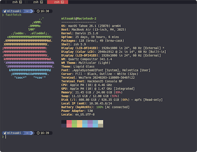
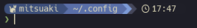

# BUG2026をご覧のみなさまへ
## ようこそ！
このページでは、2026年1月現在の私のWezTerm、Starshipの設定を公開しています！

- [WezTermの設定ファイル](/wezterm)
- [Starshipの設定ファイル](/starship.toml)


</br>

## まず、WezTermをインストールしたいんだけど...
WezTermに興味を持ってくれたそこのあなた！
ターミナルに以下のコマンドを入力することでインストール可能です！

- macOS：ターミナルで以下を実行
```shell
brew install --cask wezterm
```

- Windows：コマンドプロンプトまたはPowerShellで以下を実行
```shell
winget install wez.wezterm
```

### 設定の仕方
macOSの場合は、`~/.config/wezterm`の配置に設定ファイルを置くのがおすすめです。
ホームディレクトリ直下に`wezterm.lua`を配置して設定することも可能です。

...すみません、Windowsの設定は分かりません。
詳しくは[公式サイト](https://wezterm.org/)を参照ください。

ちなみに、私は設定方法を学ぶ上で以下のサイトが特に参考になりました。
>- [モテるターミナルにカスタマイズしよう（WezTerm）](https://zenn.dev/mozumasu/articles/mozumasu-wezterm-customization#%E3%82%AD%E3%83%BC%E3%83%90%E3%82%A4%E3%83%B3%E3%83%89%E8%A8%AD%E5%AE%9A%E3%83%95%E3%82%A1%E3%82%A4%E3%83%AB%E3%82%92%E4%BD%9C%E6%88%90)
>- [Commentary of Dotfiles](https://coralpink.github.io/commentary/index.html)

## StarShipもインストールしたいな
</br>
せっかくならプロンプトの見た目も変えたいものです。
以下のコマンドでインストール可能です。

- macOS：ターミナルで以下を実行
```shell
brew install starship
```
その後、シェルの設定ファイル（通常は`~/.zshrc`）に以下を記述
```shell
eval "$(starship init zsh)"
```

- Windows：コマンドプロンプトまたはPowerShellで以下を実行
```shell
winget install --id Starship.Starship
```
その後PowerShellの構成の最後に以下を追加（`$PROFILE`を実行して探せるらしい）
```shell
Invoke-Expression (&starship init powershell)
```

こちらも詳しくは、[公式サイト](https://starship.rs/)を参照ください！

### 設定方法
設定ファイルは、macOSの場合は`~/.config/starship.toml`を作成すると設定できます。最初は[公式サイトのプリセット](https://starship.rs/ja-JP/presets/)を使用するのがおすすめです。

アイコンを使いたい場合はNerdフォントをインストールするのも忘れずに！ちなみに私は[白源 (はくげん／HackGen)フォント](https://github.com/yuru7/HackGen)を使用しています。


## それでは、楽しいターミナルライフを！